# Personal Projects
### **1. Dynamic Wordle (C++)**

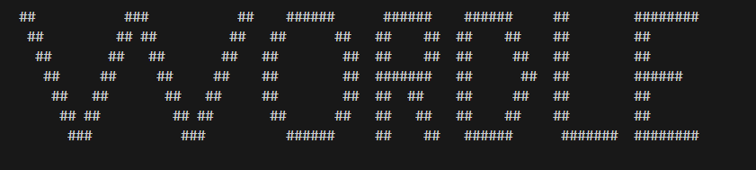 

#### **Project Overview**

- Contains three parts: main.cpp, setup.h, word.txt

  **main.cpp**
  -     Switch case is used to decide path and this file contains instruction for encyrption and decrypiton
  **setup.h**
  -     The game is organized by Classes and regulated by the Constructor that performs necessary structuring logic and loops 
  **word.txt**
  -     contains the word that the player is trying to figure out and is encyrpted using the technique of repositioning

#### **Technical Details**

- Classes Using Inheritance and Public, Private and Protected
- Functions: Pass-by-Value and Pass-by-Reference with Return types
- Input and Output File-Stream
- Specialized Loops
- Switch Expression
- Header Files

#### **Main Menu**

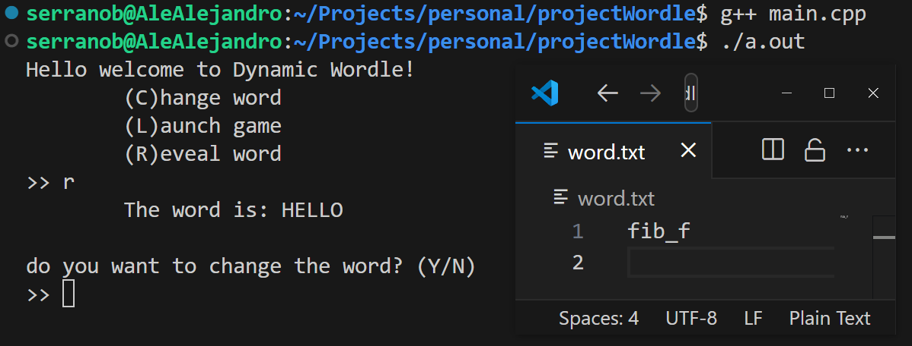 

- **Reveal**
  -     This option obtains the encrypted word from word.txt and is deciphered followed by outputing to the player 
- **Change**
  -     This option takes the players word and enciphers it followed by over-writing the exisiting word in word.txt   
- **Launch**
  -     This option deciphers word and uses the class constructer to perform a series of task to start the game

#### **demonstration**

The header contains the instruction of game and the following is demonstration of the game.

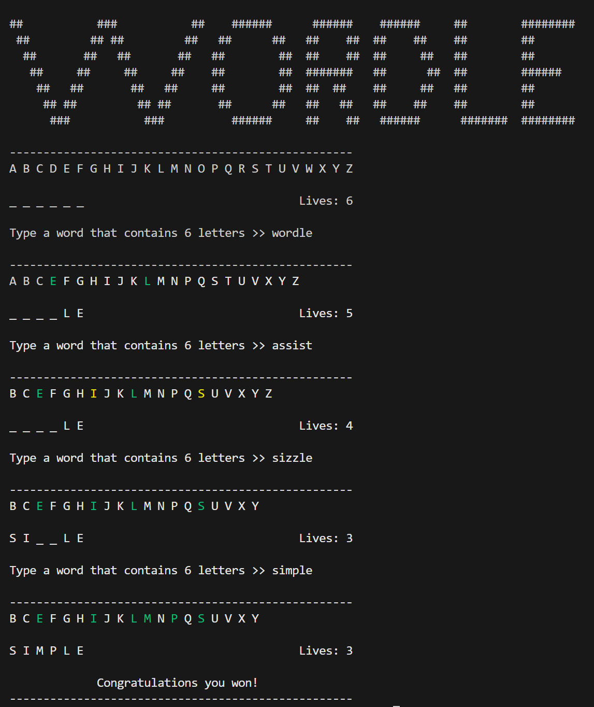 

After each attempt the list of letters at the top will removes the letters that are not in the word you are attempting figure out. 
The valid letters are highlight one of two colors to indicate the following. 

- **Green**
  -     That all of the letter have been placed in the correction position of the word you are attempting to figure out 
- **yellow**
  (Has two meanings)
  
  -     1.) A valid letter was correctly placed however not all of this letter have been found in the word
  -     2.) The letter is not in the correction position but it is in fact necessary to complete the word  

#### **Outline of Code**
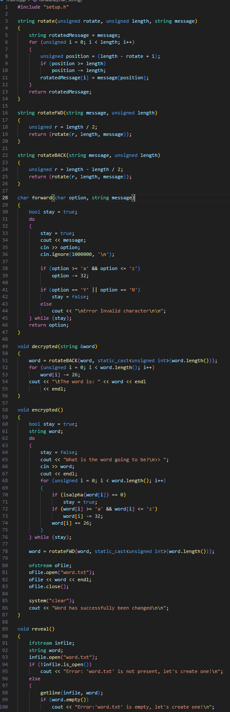 
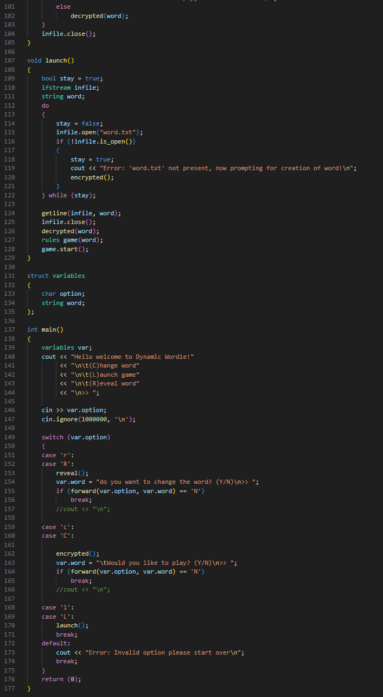 
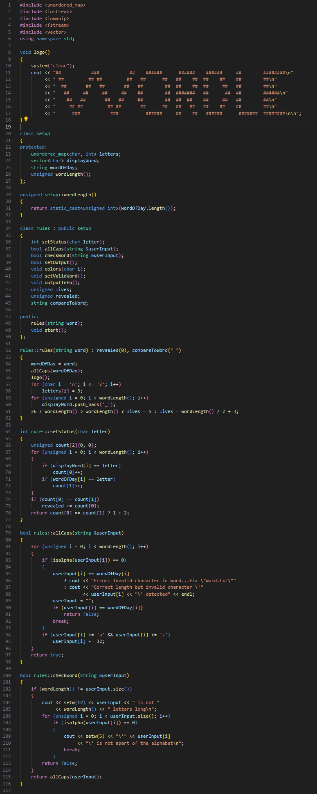 
 

### **2. 3D Torus Visualization (C++ & Assembly)**

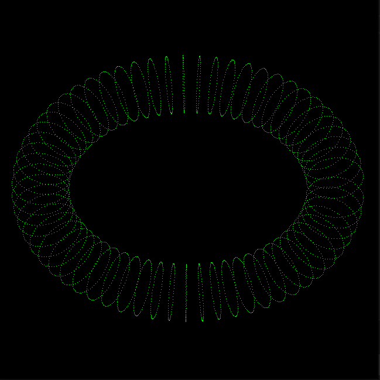 

#### **Project Overview**
- A combination of C++ and Assembly (x86_64) used to create graph a Torus.
- Contains three parts: torus.cpp, a10procs.asm, makefile
- allows the construction a various size and color Torus 

#### **Technical Details**
- **xxxx:** xxxx.
- **xxxx:** xxxx.
- **xxxx:** xxxx
- **Graphics Rendering:** Utilized OpenGL in C++ to render the torus in a vivid 3D space.
- **User Interaction:** Allowed users from the terminal to customize the size and color of torus.

#### **result**
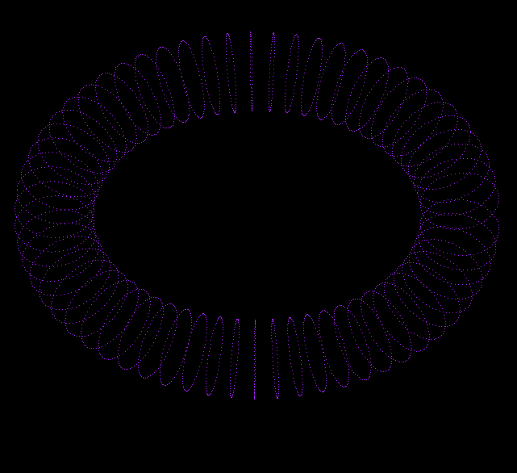 

#### **Outline of Code**
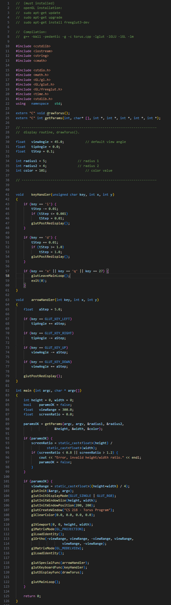 
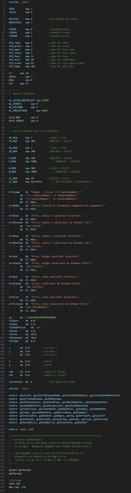 
 
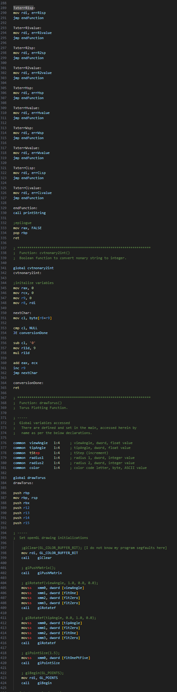 
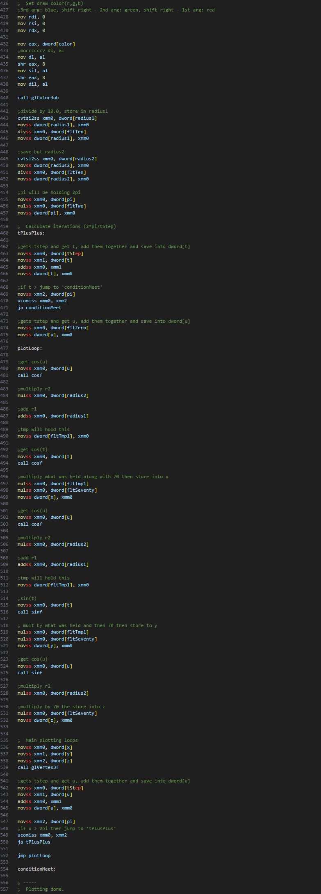 
 
