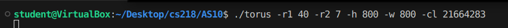

# Personal Projects
### **1. Dynamic Wordle (C++)**

 

#### **Project Overview**

- Contains three parts: main.cpp, setup.h, word.txt

- **main.cpp**
  -     Switch case is used to decide path and this file contains instruction for encryption and encryption  
- **setup.h**
  -     The game is organized by Classes and regulated by the Constructor that performs necessary structuring logic and loops   
- **word.txt**
  -     contains the word that the player is trying to figure out and is encrypted using the technique of repositioning

#### **Technical Details**

- Classes Using Inheritance and Public, Private and Protected
- Functions: Pass-by-Value and Pass-by-Reference with Return types
- Input and Output File-Stream
- Specialized Loops
- Switch Expression
- Header Files

#### **Main Menu**

 

- **Reveal**
  -     This option obtains the encrypted word from word.txt and is deciphered followed by outputting to the player 
- **Change**
  -     This option takes the players word and enciphers it followed by over-writing the existing word in word.txt   
- **Launch**
  -     This option deciphers word and uses the class constructer to perform a series of task to start the game

#### **demonstration**

The header contains the instructions for the game and the following is a demonstration of the game.

 

After each attempt the list of letters at the top will remove the letters that are not in the word you are attempting to figure out. 
The valid letters are highlighted in one of two colors to indicate the following. 

- **Green**
  -     That all the letters have been placed in the correction position of the word you are attempting to figure out 
- **yellow**
  (Has two meanings)
  
  -     1.) A valid letter was correctly placed, however not all letters have been found in the word
  -     2.) The letter is not in the correction position, but it is in fact necessary to complete the word  

#### **Outline of Code**
 
 
 
 

### **2. 3D Torus Visualization (C++ & Assembly)**

 

#### **Project Overview**

- Contains three parts: torus.cpp, a10procs.asm, makefile

- **torus.cpp**
  -     This file includes everything necessary to initialize OpenGL and calls necessary functions from the assembly file
- **a10procs.asm**
  -     Read's the user's input from the command line to ensure all values are valid then calculate the requested variables by the .cpp file
- **makefile**
  -     This makefile performs the necessary steps to properly compile the .asm file to be able to run the program

#### **Technical Details**

- Linux environment with appropriate hardware or emulator designed to manage Assembly (x86_64)
- Functions: Pass-by-Value and Pass-by-Reference with Return types
- Understanding of Registers and managing different data types
- Understanding of CLA and converting string to integer
- Understand Standard Calling Conventions
- The installation of OpenGL

#### **Command Line Arguments from Terminal**

 

The arguments listed above can be briefly explained below.

- **./torus**
  -     Operation to execute the compiled code torus
- **-r1**
  -     Label for the radius of the major circle
- **40**
  -     Initialize the radius of the major circle to this value
- **-r2**
  -     Label for the radius of the minor circle
- **7**
  -     Initialize the radius of the minor circle to this value
- **-h**
  -     Label for the window height of the torus
- **800**
  -     Initialize the window height of the torus to this value
- **-w**
  -     Label for the window width of the torus
- **800**
  -     Initialize the window width of the torus to this value
- **-cl**
  -     Label for the color of the torus of the torus
- **21664283**
  -     Initialize the color of the torus to this value

#### **Result**

The Command Line Arguments illustrates the following structure.        

 

#### **Outline of Code**
 
 
 
 
 
 
