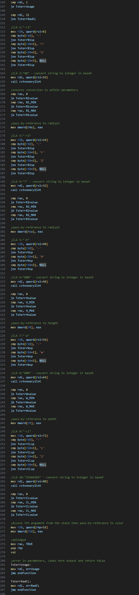
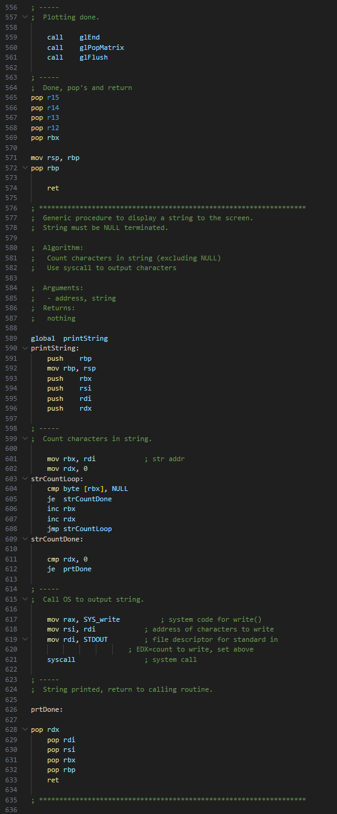

# Personal Projects
### **1. Dynamic Wordle (C++)**

 

#### **Project Overview**
- A C++ project inspired by the popular Wordle game.
- Contains three parts: main.cpp, setup.h, word.txt
- Flexible gameplay allows players to solve words of any length and change immediately for easy replayability.
- **Performance Optimization:** limits the usage of loops by apply hashmaps and other techniques.

#### **Technical Details**
 

talk about the three options

- **Reveal**
**Decryption:** Implements encryption of the word so you can't solve the game by opening the word.txt file.
- **Change**
**Encryption:** Implements encryption of the word so you can't solve the game by opening the word.txt file.
- **Launch**
**Inheritance:** xxxx

#### **result**
 

#### **Outline of Code**
 
 
 
 

### **2. 3D Torus Visualization (C++ & Assembly)**

 

#### **Project Overview**
- A combination of C++ and Assembly (x86_64) used to create graph a Torus.
- Contains three parts: torus.cpp, a10procs.asm, makefile
- allows the construction a various size and color Torus 

#### **Technical Details**
- **xxxx:** xxxx.
- **xxxx:** xxxx.
- **xxxx:** xxxx

#### **result**
 

#### **Outline of Code**
 
 
 
 
 
 
